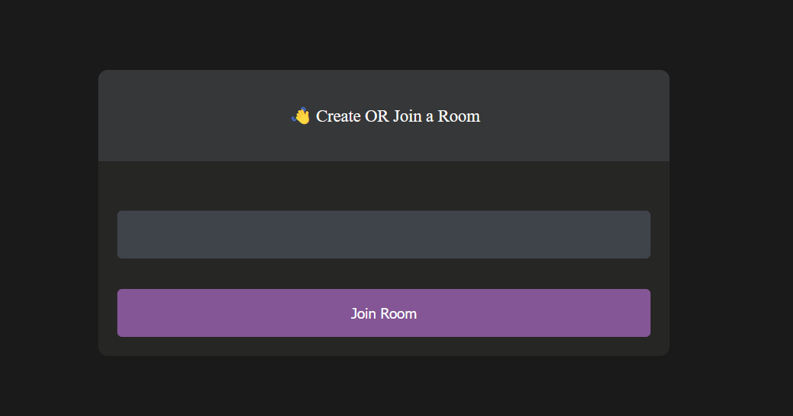
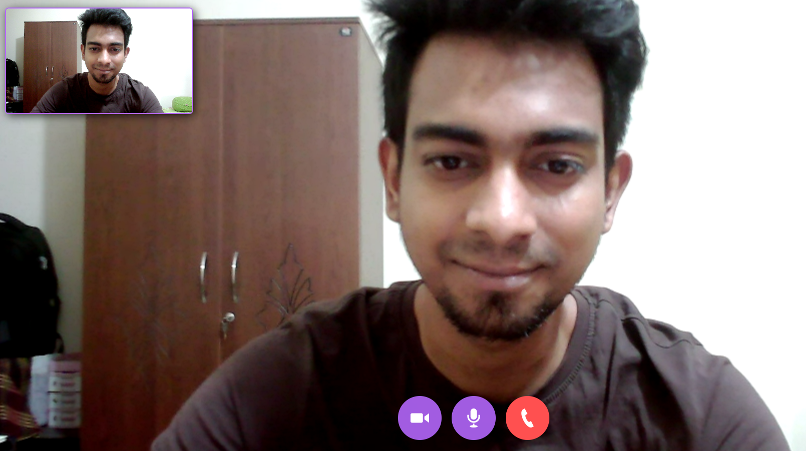
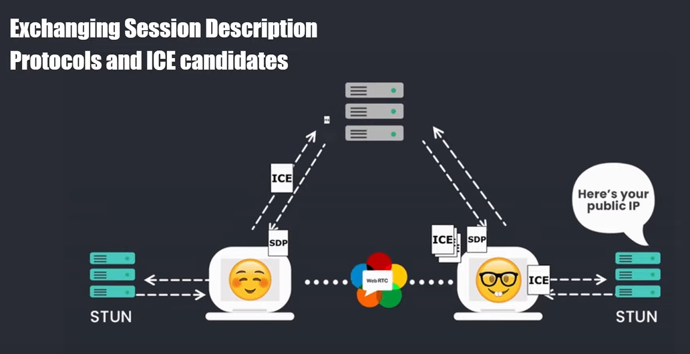

You can visit and experience it ->

# PeerChat
A peer to peer WebRTC application with controls

# Installation
* 1 - Create an account on agora.io and create an app to generate an APP ID
* 2 - Update APP ID, Temp Token and Channel Name in main.js
```javascript
let APP_ID = "YOU-APP-ID"
```

# Room Page
  

# Video Call Page
 

# Methodology
 
